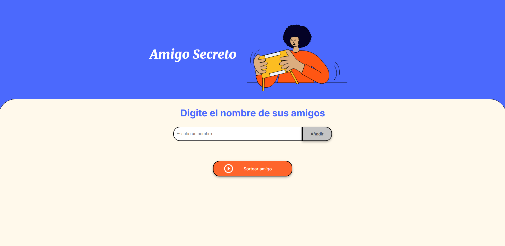
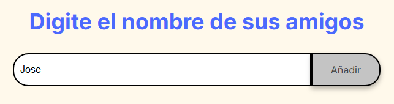
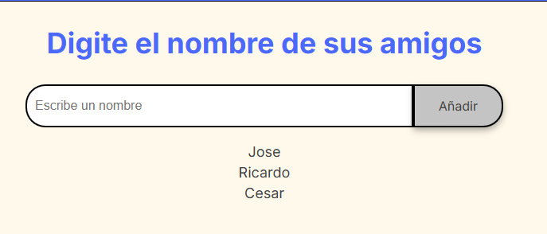
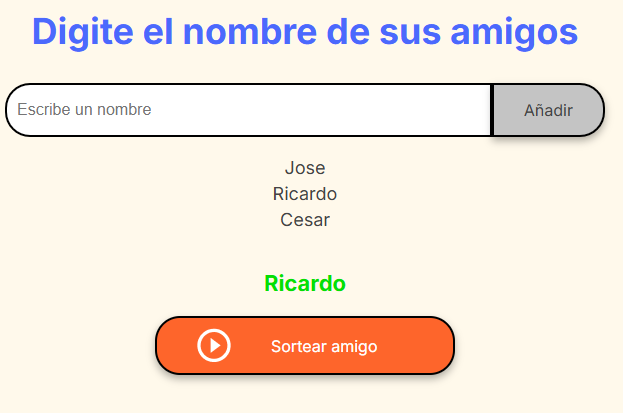

# 📄 Challenge Amigo Secreto

Este mini proyecto, es un challenge estipulado con **Alura**.

La funcionalidad consiste, en que el usuario Ingrese nombres de amigos, para posteriormente seleccionar un nombre aleatorio de dicha lista que se ingreso

# Herramientas
Se derrollo esta aplicación, por medio de:  

# 📝 Maquetado

# 👾 Funcionamiento
1. Se deben de ingresar un nombre en el cuadro de texto y posteriormente darle click en el boton de **"Añadir"**

2. Los amigos que ingrese se irán mostrando en la parte inferior en lista

3. Al dar click en el boton **"Sortear Amigo"**, mostrar en texto de color verde el nombre que salio aleatoriamente

